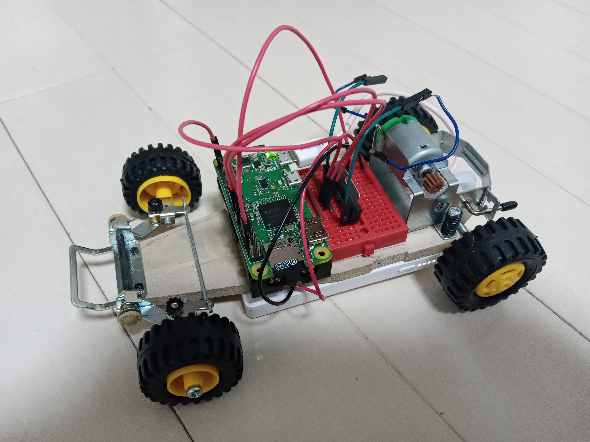
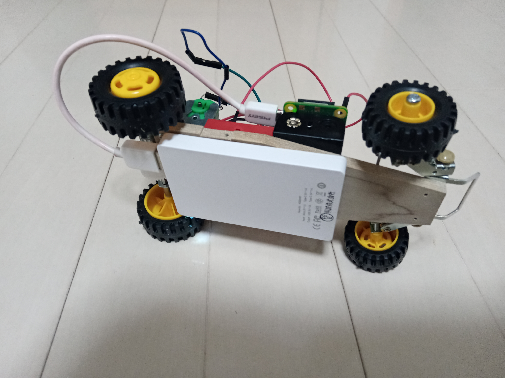

# raspberry pi を使用したミニ四駆ラジコン化計画

## 経緯
タイトルだけ聞くとよくある話ですne。

## 成果
### ver 0.6 DCモータ制御(前後移動のみ)
 - 左側面
   
  
 - 底面
   
  
 - 動作結果
   

### ver 1.0 サーボモータ制御(左右へのステアリング)
※近日挑戦予定！以下、課題(モータ制御までは実装済)
 - サーボモータ電源の配置場所がない(5V電源必要)
 - ステアリング方法(タイヤを並行に引く方法)

## 必要環境
 - ソフトウェア
 - raspberry pi zero WH
 - [タミヤ「バギー工作基本セット」](https://www.tamiya.com/japan/products/70112/index.html)※←直進しかしません
 - モバイルバッテリー(raspberry pi 駆動用)
 - 単三電池×2本(DCモータ 駆動用)
 - ミニブレッドボード
 - python 3.x(当方 3.7.3)
   - django
   - pigpio (GPIO制御)

## 配線
（あとでアップします）

## 身についた知識
 - ソフトウェア
   - Python基礎～クラス実装 … \__init\__、selfとか
   - Python djangoフレームワーク … WebApp、WebAPI
   - Html、Css装飾、canvas … 円弧、アニメーション
   - Python pigpioライブラリ … Raspberry pi GPIO制御
 - ハードウェア
   - 電流と電圧 (^^;
   - DCモータとモータドライバ
   - サーボモータ
   - PWM、パルス幅

## トラブル、苦労話とか
 - コントローラを模したWebアプリで、UI開発ノウハウが大変勉強になりました。特にcanvasを使用した円弧の描画など。
 - Pythonとdjangoは初めて使いましたが、Webルーティングの方法がわからず、jsやcssを外部化するのに苦労しました。
 - 以前から使いまわしていた電池ボックスで動かすとサーボモータが安定動作しなかった。原因はうち１本だけ、電池が空になっていた。テスターでチェックして判明。
 - 一度、古かった電池を引っ張り出して使っているときに、破裂音が鳴って、電池液がぐじゅぐじゅ出てきました(笑)
