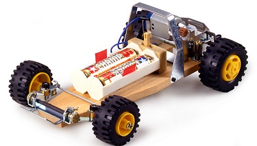
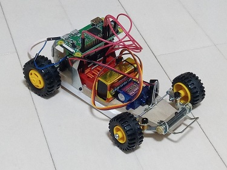
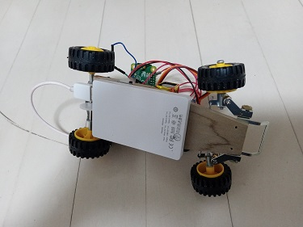
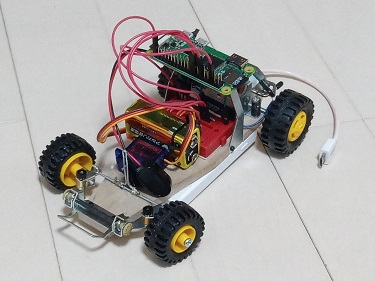
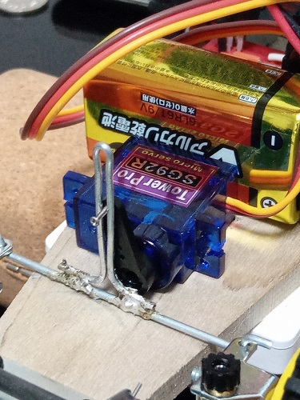
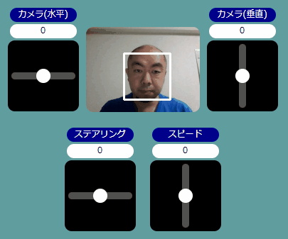
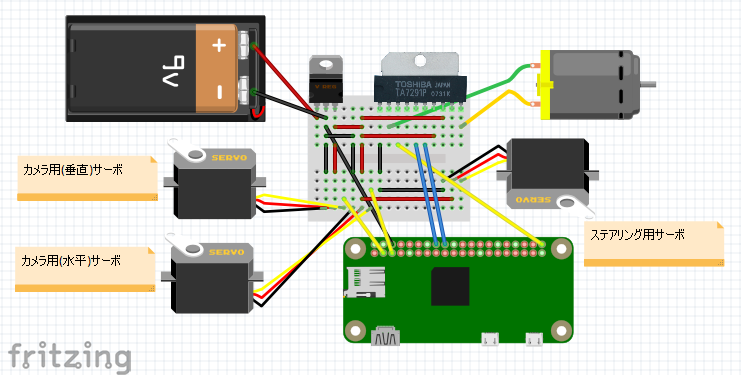

# raspberry pi を使用したミニ四駆ラジコン化計画

## 経緯
内容はタイトルのとおりです。ググるとあちこちに載っていますが、極力自力で工夫して実装しました。

## リリース
#### ver 0.6 DCモータによる前後移動のみ実装
#### ver 1.0 DCモータによる前後移動と、サーボモータのステアリング実装

## 必要環境
 - ソフトウェア
   - python 3.7.3
     - django
     - pigpio (GPIO制御)

 - ハードウェア
   - raspberry pi zero WH
   - [タミヤ「バギー工作基本セット」](https://www.tamiya.com/japan/products/70112/index.html)※←本来、直進しかしない
   - モバイルバッテリー(raspberry pi用)
   - 9V型乾電池×1本(各種モータ駆動用)
   - ミニブレッドボード
   - モータ制御ドライバ(TA7291P)
   - 三端子5V1Aレギュレータ(NJM7805FA)
   - ステアリング制御サーボモータ(SG92)

## 画像と実装内容
 - ベースキット  
   #### 下がラジコンのベースにしたベースキットです。タミヤさんから1,500円程度で発売されていますが、これだけでは、電源ONに応じて直進しかできません。
   
  
 - 前面 - 右側面  
   #### 上のキットを下図のように作り変えました。単三電池を取り外し、ブレッドボード(赤)、9V角電池、ステアリングサーボを置くスペースを作りました。上部ゲージの上にRaspberryPiを置いていますが、両面テープで張り付けているだけです。
   
  
 - 底面  
   #### 底面にはモバイルバッテリーを張り付けており、RaspberryPiの電源はここから供給しています。
   

 - 前面 - 左側面  
   #### 配線関係は後述しますが、モーター系の電源はRaspberryPiと別にしていて、今回は9V角電池から、5Vレギュレータを介して入力しています。ステアリング用のサーボモータの配置と制御に大変苦労しました。
   
  
 - ステアリング部拡大  
   #### ステアリング部分の拡大図です。サーボモータの駆動を、どのようにすれば左右のステアリングに活かせるかを考えた末、下図のように針金をまげてレールを作り、ハンダで固定。サーボに刺したネジをあてました。サーボモーター自体は瞬間接着剤で木の板に協力に張り付けてあります。
   
  
 - 操作テスト  
   #### 操作画面から各モーターの動作テストを行いました。設計ミスで、ステアリングモーターと針金の隙間を狭くしすぎてしまい、少しぎこちないですが、前後左右、なんとか動くことを確認できました。
   

 - 操作画面  
   #### 操作画面はJavaScript+JQuery+Canvasで作成しています。スマホでの使用を前提に考えたため、複数同時操作を実現せねばならず、touchStart、touchMove、touchEndイベントでマルチタッチを実現しています。また、指を話した際には、一定時間おきにsetInterval()でCanvas上のマルをもとの位置に戻すようにしました。（下に出ている顔の部分は、今回OFFにしました。次期Versionで、OpenCvで撮影した顔認識画像を表示する予定です。重い！）
   
  
 - 走行確認  
   #### 下のとおり、なんとか前後左右、一応動くようになりました（操作下手なのでぶつかってばかりですが…）頑張って操作画面を作ったのですが、これでやろうとすると画面が小さすぎて難しいことがわかりました。今度、機会があればHTML5のGamePad？機能を使用してプレステコントローラなどをつなげてみようと思います。
   

## 配線
   #### 配線面ではモバイルバッテリからの供給と別にモーター用電源を確保するのに工夫が必要でした（モバイルバッテリから5V取ろうとすると、モーターを動かした瞬間にRaspberryPiが電圧不足で落ちる）。結論としては9V角電池を、三端子レギュレータで5Vに落とし、両モーターの電源としています。この場合、どの程度の放熱がされるのか、どの程度電池が持つかなどもう少し勉強が必要そうです。
   

## 身についた知識
 - ソフトウェア
   - Python基礎～クラス実装 … \__init\__、selfとか
   - Python djangoフレームワーク … WebApp、WebAPI
   - Html、Css装飾、canvas … 円弧、アニメーション
   - Python pigpioライブラリ … Raspberry pi GPIO制御
 - ハードウェア
   - 電流と電圧 (^^;
   - DCモータとモータドライバ
   - サーボモータ
   - PWM、パルス幅

## トラブル、苦労話とか
 - コントローラを模したWebアプリで、UI開発ノウハウが大変勉強になりました。特にcanvasを使用した円弧の描画など。
 - Pythonとdjangoは初めて使いましたが、Webルーティングの方法がわからず、jsやcssを外部化するのに苦労しました。
 - 以前から使いまわしていた電池ボックスで動かすとサーボモータが安定動作しなかった。原因はうち１本だけ、電池が空になっていた。テスターでチェックして判明。
 - 一度、古かった電池を引っ張り出して使っているときに、破裂音が鳴って、電池液がぐじゅぐじゅ出てきました(笑)
 - 最も苦労したのは、ステアリングの動力系。針金を曲げたりハンダでつけたりと、結局、手の工作作業が一番難しかったです。この手の作業は嫁さんの方がうまいんだよなぁ…。
